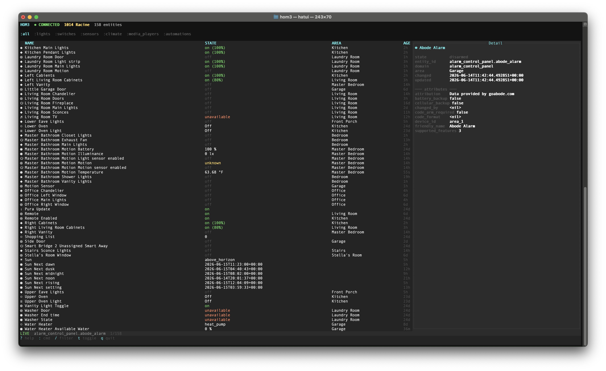

# hom3

k9s-inspired terminal UI for Home Assistant



Navigate your entire Home Assistant setup from the terminal — just like `k9s` for Kubernetes.

---

## Features

- **Resource-based navigation** — jump to any device type with `:lights`, `:sensors`, `:climate`, etc.
- **Live state streaming** — subscribes to HA WebSocket, updates in real-time
- **Area filtering** — filter by area with `:lights kitchen` or use the area selector in the header
- **Fuzzy filter** — press `/` to filter entities by name, entity_id, or state
- **Toggle & control** — `t` toggles lights/switches/fans/locks; `+`/`-` adjusts brightness, temperature, volume
- **Detail panel** — attributes, domain-specific controls, and timing for the selected entity
- **Multi-home context switching** — manage multiple HA instances and switch between them with `C` or `:homes`
- **Cyberpunk/synthwave theme** — cyan, magenta, neon green on dark

---

## Quick Start

### Install from npm (recommended)

```bash
npm install -g @k5s/hom3
```

Then run:

```bash
hom3
```

### Install from source

```bash
git clone https://github.com/you/hom3
cd hom3
npm install
npm run build
npm start
```

### Configure

```bash
mkdir -p ~/.config/hom3
cat > ~/.config/hom3/config.json << 'EOF'
{
  "homes": [
    {
      "name": "Home",
      "url": "http://homeassistant.local:8123",
      "token": "your_long_lived_access_token"
    }
  ]
}
EOF
```

Get a token: **HA → Profile → Long-Lived Access Tokens**

---

## Keybindings

| Key | Action |
|-----|--------|
| `↑` / `k` | Move up |
| `↓` / `j` | Move down |
| `g` / `Home` | Jump to top |
| `G` / `End` | Jump to bottom |
| `PgUp` / `PgDn` | Page up/down |
| `Enter` | Activate selected entity |
| `:` | Open command mode |
| `/` | Filter (fuzzy search) |
| `t` | Toggle selected entity |
| `+` / `-` | Adjust brightness, temperature, volume, etc. |
| `d` | Toggle detail panel |
| `n` | Rename selected entity |
| `a` | Set area for selected entity |
| `r` | Refresh all states |
| `C` | Open context switcher (multi-home) |
| `?` | Toggle help overlay |
| `q` / `Ctrl+C` | Quit |

---

## View Commands

Type `:` then any of the following:

| Command | View |
|---------|------|
| `:all` | All entities |
| `:lights` | Lights |
| `:switches` | Switches |
| `:sensors` | Sensors |
| `:binary_sensors` / `:bs` | Binary sensors |
| `:climate` | Climate |
| `:covers` | Covers |
| `:fans` | Fans |
| `:media` / `:media_players` | Media players |
| `:automations` / `:auto` | Automations |
| `:scripts` | Scripts |
| `:scenes` | Scenes |
| `:locks` | Locks |
| `:cameras` | Cameras |
| `:vacuums` | Vacuums |
| `:alarms` | Alarm panels |
| `:weather` | Weather |
| `:buttons` | Buttons |
| `:numbers` | Number inputs |
| `:selects` | Select inputs |
| `:inputs` | Input helpers |
| `:homes` / `:ctx` | Context switcher (multi-home) |
| `:quit` | Quit |

Append an area name to scope a view: `:lights kitchen`, `:sensors bedroom`

---

## Multi-Home Context Switching

HOM3 supports multiple Home Assistant instances, similar to how k9s handles multiple Kubernetes clusters.

**Open the context switcher** with `C` or `:homes` — the main table switches to a `contexts` view listing all configured homes. Navigate with `j`/`k`, press `Enter` to connect, `Esc` to cancel.

The active home name is shown as a badge in the header (top-right of the title bar).

---

## Configuration

HOM3 loads config in this order of precedence:

| Source | Variables / Flags |
|--------|-------------------|
| CLI flags | `--url`, `--token`, `--name` |
| Environment variables | `HASS_URL`, `HASS_TOKEN`, `HASS_NAME` |
| Config file | `~/.config/hom3/config.json` |

### Single home

```json
{
  "url": "http://homeassistant.local:8123",
  "token": "your_long_lived_access_token"
}
```

### Multiple homes

```json
{
  "homes": [
    {
      "name": "Home",
      "url": "http://homeassistant.local:8123",
      "token": "your_long_lived_access_token"
    },
    {
      "name": "Cabin",
      "url": "http://192.168.1.100:8123",
      "token": "another_token"
    }
  ]
}
```

---

## Project Structure

```
src/
├── index.ts        # Entry point, config loading
├── app.ts          # Main app controller, key bindings, event loop
├── hass-client.ts  # Home Assistant WebSocket client
├── renderer.ts     # All rendering logic (rows, detail, bars)
├── widgets.ts      # blessed widget factories
├── theme.ts        # Colors, icons, state formatters
└── types.ts        # TypeScript types
```

